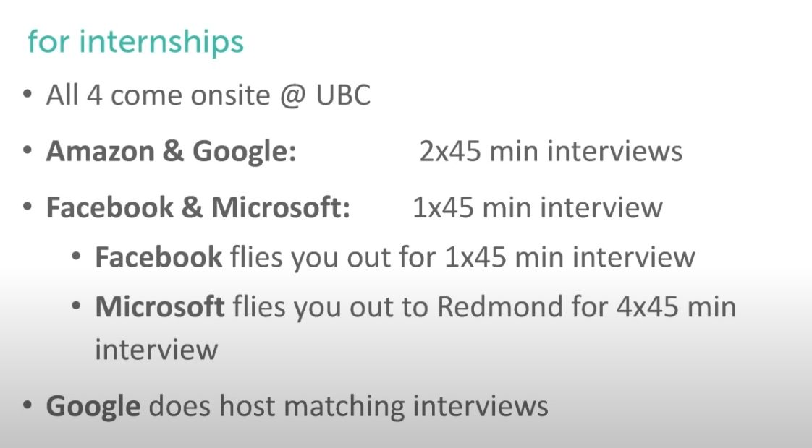
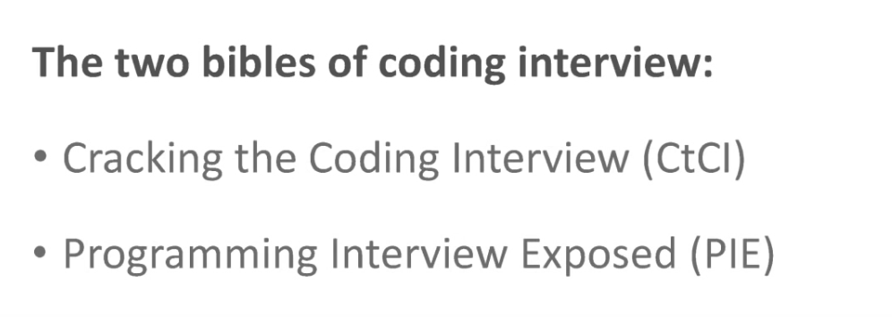
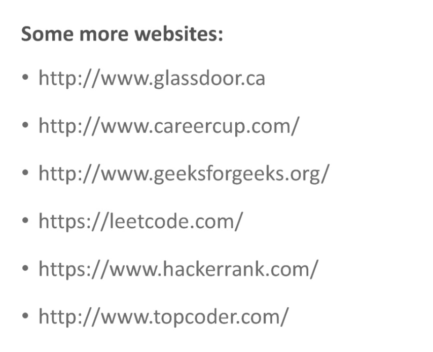
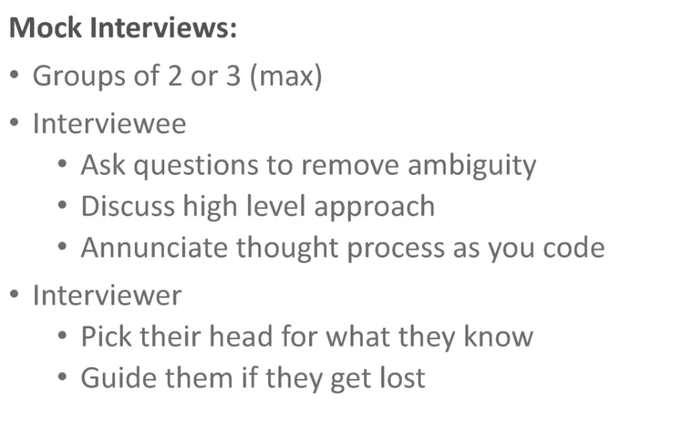

link: https://www.youtube.com/watch?v=YJZCUhxNCv8

Why The Big 4?

1. Brand Equity
2. Pay
3. Easier..?

Because of their size, they don’t hire iOS developers or front-end developers, they just hire software engineers.

2 Simple Steps To Get A Job at The Big 4

Step 1: Get an interview… somehow

1. Apply with Resume
2. Programming Challenges
3. Referrals

Step 2: Do well on the interview

!!! PIE is a little bit out of time, CtCI still work.

make interview as part of your life, than when you have a interview, you can take part in it confidently.